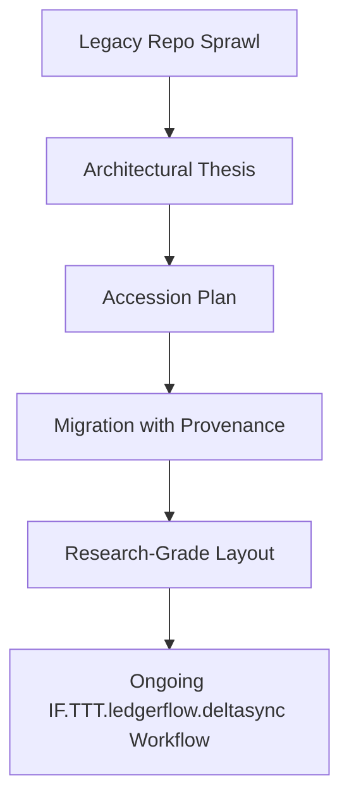
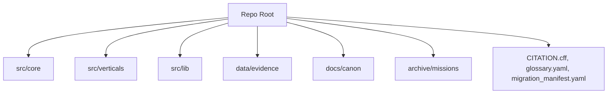
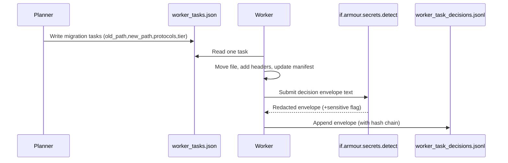
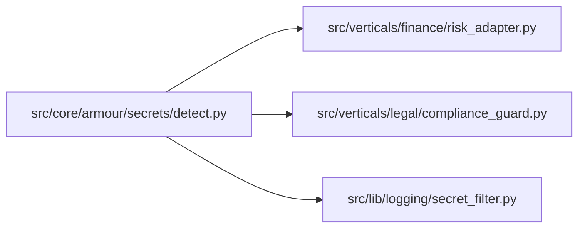
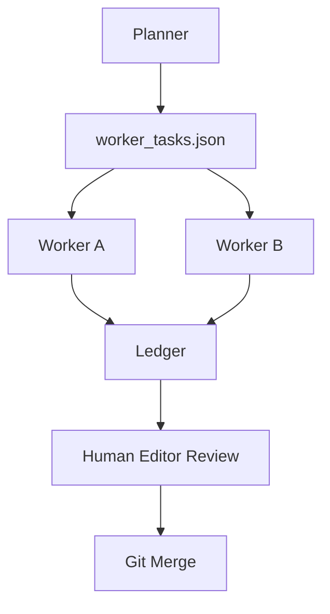

# IF.TTT.ledgerflow.deltasync — Research-Grade Repository Restructure

**Author:** Danny Stocker  
**Citation:** `if://whitepaper/if.ttt.ledgerflow.deltasync/repo-restructure/v1.0`  
**Date:** 2025‑12‑06  
**Scope:** End‑to‑end protocol for turning a sprawling research/code repo into a researcher‑grade, provenance‑preserving archive using IF.TTT.ledgerflow.deltasync and if.armour.secrets.detect.

---

## 1. Why this refactor exists

> *The real risk isn’t messy code; it’s a body of work you can’t defend in public.*

The existing repository has grown into a dense, multi‑year research dump: protocols, swarms, experiments, missions, scripts, and narratives all co‑habiting. It contains value, but not structure. IF.TTT.ledgerflow.deltasync is the coordination fabric that turns that sprawl into a **reference implementation**: every file accessioned, every move justified, every decision logged.

| Problem | Symptom in today’s repo | Consequence |
|---------|--------------------------|-------------|
| No architectural thesis | Protocols, missions, tools intermixed | Hard to teach, hard to fork |
| No accession trail | Files moved/renamed without provenance | Breaking research‑grade traceability |
| No secret discipline | Legacy logs/scripts with tokens & PII | Legal/compliance risk |
| No clear OS vs. verticals split | Core + experiments entangled | Hard to reuse in new domains |

**Why it matters:** Without a **formal refactor protocol**, future readers can’t tell what is canonical, what is experimental, or how decisions were made. With it, the repo becomes a living paper: intro (thesis), methods (core), experiments (verticals), data (evidence), and appendices (missions) — all linkable, all defensible.



**Why now:** The repo is already being used as de facto infrastructure and teaching material. If we don’t fix the layout and provenance **before** more teams rely on it, any later clean‑up will feel like revisionist history instead of methodical accession.

*Et si the real asset isn’t the code at all, but the ability to show how it got there?*

*People don’t follow an architecture because it’s elegant; they follow it because it lets them explain their choices without flinching.*

---

## 2. Architectural thesis: how the repo should look

> *A research repo that doesn’t read like a paper is a storage bucket, not a reference implementation.*

The target layout is a **paper‑shaped file system**:

- `/src/core` — the OS: immutable protocol implementations (IF.TTT, if.armour.secrets, routing, logging).
- `/src/verticals` — experiments/verticals: finance, legal, swarms, missions.
- `/src/lib` — shared utilities not tied to a single protocol or vertical.
- `/data/evidence` — immutable experimental artifacts: Redis dumps, Chroma vectors, chat logs, evaluation outputs.
- `/docs/canon` — canonical docs: protocol inventories, skeletons, whitepapers.
- `/archive/missions` — mission reports, one‑off scripts, notebooks.
- Root meta: `CITATION.cff`, `glossary.yaml`, `migration_manifest.yaml`, `dependency_map.yaml`, `ROADMAP.md`, `STATE_S0.md`.

| Directory | Purpose | Examples |
|-----------|---------|----------|
| `src/core` | Research OS | IF.TTT engine, if.armour.secrets.detect, routing, logging |
| `src/verticals` | Domain plugins | Finance risk vertical, legal review swarm, narrative engines |
| `src/lib` | Cross‑cutting utilities | logging helpers, config loaders, small math libs |
| `data/evidence` | Raw & derived data | Redis exoskeleton dumps, eval logs, embeddings |
| `docs/canon` | Canonical texts | IF_PROTOCOL_COMPLETE_INVENTORY, skeleton docs, whitepapers |
| `archive/missions` | Legacy/experiments | MISSION_REPORT_*.md, ad‑hoc scripts, notebooks |

**Insight:** This structure answers the question “What is stable OS vs. what is an experiment?” in the same way a good paper answers “What is theorem vs. what is a proof sketch vs. what is an appendix.”



**Why now:** As protocols like IF.TTT and if.armour.secrets move from experimental to production, the repo must reflect that status. If core and experiments share the same drawer, nothing feels canonical.

*Et si your long‑term moat is not what you built, but how easy it is for someone else to rebuild it from the repo index alone?*

*Architects don’t just fear bugs; they fear the moment a junior engineer can’t tell which directory is safe to depend on.*

---

## 3. Provenance: from “moving files” to accessioning

> *You are not refactoring files; you are accessioning artifacts into an archive.*

A research‑grade migration cannot be “just move it.” Every file that leaves the legacy tree must:

- Have its **original path and hash** recorded.
- Declare its **new canonical path**.
- Be wrapped in a **metadata header** (for Markdown/Python) or sidecar manifest (for binaries).
- Emit a ledger entry via IF.TTT.ledgerflow.deltasync.

| Artifact | Field | Example |
|----------|-------|---------|
| `migration_manifest.yaml` | `old_path` | `src/infrafabric/core/yologuard.py` |
|  | `new_path` | `src/core/armour/secrets/detect.py` |
|  | `sha256_before/after` | `06a1…` / `1b9c…` |
|  | `protocols` | `[IF.TTT, if.armour.secrets]` |
|  | `tier` | `core` |
| Markdown/Python header | `Original-Source` | legacy path |
|  | `IF-Protocols` | `[IF.TTT, IF.LEDGERFLOW]` |

**Insight:** The migration manifest is not a convenience; it is the **methods section** of the refactor. Without it, you can’t honestly claim the repo is research‑grade.

```mermaid
graph LR
    L[Legacy File] --> H[Compute sha256_before]
    H --> M[Add manifest entry]
    M --> W[Rewrite with metadata header (if text)]
    W --> N[New File Location]
    N --> R[Recompute sha256_after]
    R --> M
```

**Why now:** Once people start using the new paths, the cost of reconstructing what moved from where explodes. Accessioning as you go is the only cheap moment to get this right.

*Et si the real publication isn’t the new structure at all, but the migration_manifest.yaml that proves nothing was quietly dropped?*

*Reviewers don’t just distrust missing data; they distrust any story that can’t show how it handled the mess it came from.*

---

## 4. The migration engine: IF.TTT.ledgerflow.deltasync in action

> *If you can’t replay the migration, you didn’t design a protocol—you ran a script.*

IF.TTT.ledgerflow.deltasync turns the refactor into a **sequence of accountable decisions**:

- Planner (large‑context agent or human) defines:
  - Architectural thesis (target tree).
  - Migration ROADMAP (R0) and STATE_S0.
  - A worklist of migration tasks in `worker_tasks.json` (M1).
- Worker agents:
  - Take each migration task (copy/move/header/update manifest).
  - Perform the change.
  - Emit a **Decision Envelope** into `worker_task_decisions.jsonl`.
- if.armour.secrets.detect:
  - Scans the envelope’s text (output, reason, evidence) to prevent secrets from entering the ledger.

| Role | Input | Output |
|------|-------|--------|
| Planner | Legacy tree, protocol inventory | Architectural thesis, ROADMAP, worker_tasks |
| Worker | Single task from worker_tasks.json | Concrete file change + decision envelope |
| Logger | Envelope | JSONL entry + hash chain |
| Secret guard | Envelope text | Redacted ledger + `sensitive=true` where needed |



**Why it matters:** The migration stops being a one‑shot operation and becomes something you can **replay, audit, and teach**.

*Et si the biggest failure mode isn’t mis‑placing a file, but not being able to explain why the file moved there three months later?*

*People don’t just fear bad migrations; they fear the political cost of owning a migration nobody can untangle later.*

---

## 5. Dependency map: puppet‑master view

> *You can’t move a load‑bearing wall without a graph of the house.*

Before moving anything, we need a **puppet‑master dependency graph** that maps:

- Which files implement which protocols.
- Which verticals depend on which core modules.
- Which utilities are truly shared vs. vertical‑specific.
- Which documents and scripts are archival, not live.

This lives in `dependency_map.yaml` and is **the oracle** for classification:

- `tier`: `core | vertical | lib | evidence | archive`
- `protocols`: `[IF.TTT, IF.PACKET, if.armour.secrets]`
- `status`: `mapped | candidate | unresolved | deprecated | duplicate`
- `confidence`: `0.0–1.0` with rationale.

| Example entry | Meaning |
|---------------|---------|
| `src/infrafabric/core/yologuard.py` → `src/core/armour/secrets/detect.py` | Core secret engine, promoted into OS |
| Protocols `[IF.TTT, if.armour.secrets]` | Implements ledger + secret patterns |
| Dependents include finance/legal verticals | Moving this file is a structural change, not local cleanup |

To avoid a permanent “purgatory” of `candidate` entries, each candidate MUST carry a `review_by_date` and an owner. If still unresolved by that date, it moves automatically into `/archive/limbo` with a note in the manifest explaining why it was not promoted to core or vertical.



**Why now:** Once teams start wiring in new verticals, the cost of mis‑classifying a file multiplies. The dependency map is how we prevent the OS from quietly importing experiments as if they were canonical.

*Et si the real design decision isn’t “where do we put this file?” but “what do we allow core to know about experiments?”*

*Architects don’t just fear cycles in code; they fear cycles in responsibility where no one can say who changed what first.*

---

## 6. Multi‑agent workflow for a massive restructure

> *You don’t need one genius agent; you need a disciplined swarm.*

For a repo of this size, a single human or monolithic model is fragile. IF.TTT.ledgerflow.deltasync encourages a **planner/worker swarm**:

- Planner profile:
  - Designs the thesis, sets up R0/S0, writes `worker_tasks.json`.
  - Handles ambiguous migrations and protocol classification.
- Worker profile:
  - Executes bounded tasks (move file N, update manifest N, add header N).
  - Emits envelopes with high/low confidence.
- Human “editor”:
  - Reviews high‑impact envelopes (core/tier‑1 code) before merge.
- Metrics:
  - Monitor escalation/block/invalid rates; tweak task sizing and routing.

| Agent | Strength | Bound |
|-------|----------|-------|
| Planner | Deep context, cross‑protocol view | No direct file edit; only writes tasks and plans |
| Worker | Fast local edits | Only one file/task at a time |
| Human editor | Judgment, ownership | Only merges core changes |



**Why it matters:** This turns “giant refactor” from a one‑shot event into a **controlled production of small, testable moves**.

*Et si the safest migration isn’t the one with the best script, but the one where no single agent or person can silently go off the rails?*

*People don’t trust big bangs; they trust systems that show each cut, one line at a time.*

---

## 7. Evaluation & future‑proofing

> *A refactor you can’t evaluate is a story you can’t update.*

Finally, we need to ask: did the restructure actually improve anything?

- **Structural metrics:**
  - # of files in `src/core` vs `src/verticals`.
  - # of unresolved entries in `dependency_map.yaml`.
  - # of “candidate” classifications remaining.
- **Workflow metrics (from ledger):**
  - Escalation + block + invalid rates.
  - Time to complete each migration phase (directory, manifest, vertical).
  - Sensitive detection rate (how often if.armour.secrets.detect redacted something).
- **Evaluation artifacts:**
  - `ledgerflow_eval.v1.json` entries, emitted by external reviewers (human or AI) against the formal eval schema.

To keep load‑bearing moves safe, each major migration batch SHOULD be preceded by a **Dry‑Run Dependency Diff**:

- Freeze the current `dependency_map.yaml`.
- Simulate planned moves and generate a “before/after” graph for core modules and their dependents.
- Require human/editor sign‑off before applying the batch.

```mermaid
graph LR
    L[worker_task_decisions.jsonl] --> M[Metrics Extractor]
    M --> K[Key KPIs]
    K --> E[External Eval (ledgerflow_eval.v1)]
    E --> R[Refactor v1.3+ Roadmap]
```

**Why now:** This refactor isn’t a one‑time event; it’s the **first version** of a research OS. Without evaluation hooks, version 1.3 will be driven by taste, not evidence.

*Et si the long‑term risk isn’t “this refactor had bugs”, but “this refactor set a precedent we never measured against anything better”?*

*People don’t commit to a new structure because it’s perfect; they commit because it comes with a way to admit and fix its imperfections across versions.*

---

## Psychological close

*Teams don’t fear messy trees as much as they fear being blamed for touching them. When every move is accessioned, every file has a story, and every decision is both hashed and humanly explainable, the repository stops feeling like a minefield and starts feeling like a lab notebook you’re proud to put your name on.*
