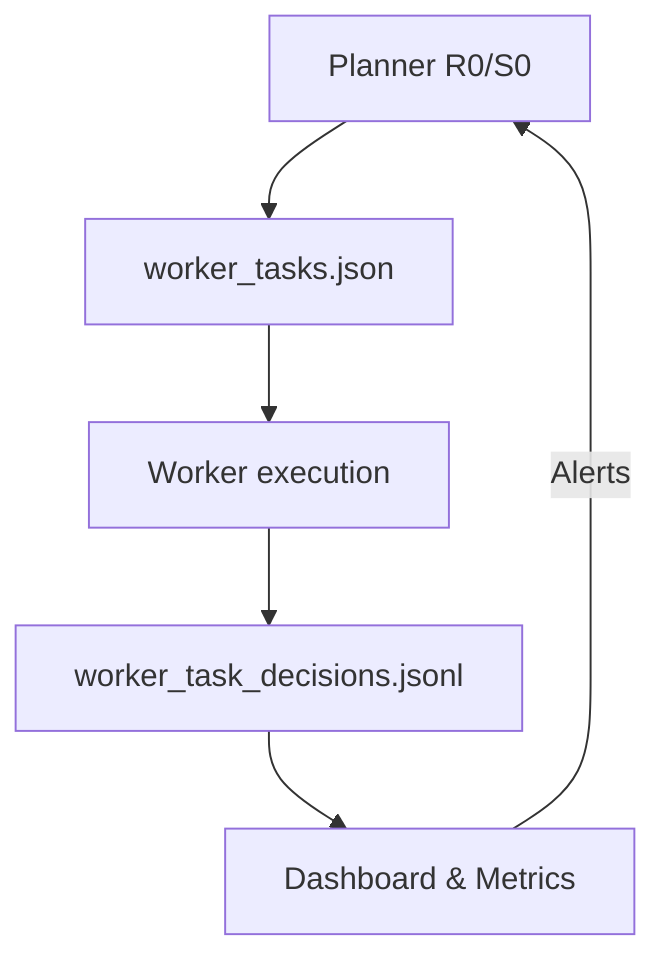
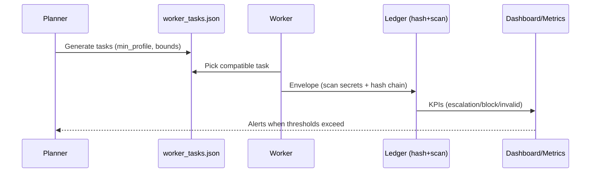
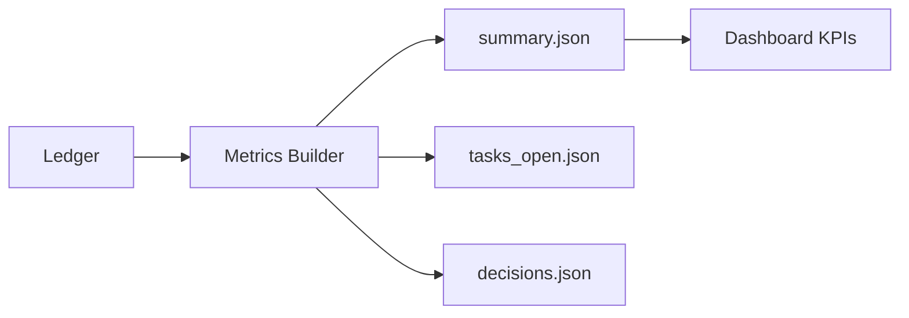

# IF.TTT.workflow.deltasync — Whitepaper (v1.0)
**Author:** Danny Stocker  
**Citation:** `if://whitepaper/if.ttt.workflow.deltasync/v1.0`  
**Date:** 2025-12-06  
**Scope:** Planner/worker protocol with tamper-evident ledger, secret-safe logging, and evaluable metrics for multi-agent operations.

## 1) Why this protocol
> *Risk isn’t the single bad call; it’s the silent drift of decisions you can’t later prove.*

Heterogeneous teams split context and accountability. IF.TTT.workflow.deltasync ties roadmap, tasks, decisions, and metrics into one spine: an append-only ledger that is hashed, schema-validated, and secret-scanned. Cold-start recovery requires no chat history; audits become reproducible.

| Element | Role | v1.2 Status | Source |
|---------|------|-------------|--------|
| `worker_tasks.json` | Worker backlog | Schema published (`/schemas`) | [A01] |
| `worker_task_decisions.jsonl` | Append-only ledger | Hash chain + secret scan | [A02] |
| `if.armour.secrets.detect` | Secret detection/redaction | Integrated in logger | [A03] |
| Dashboard (`docs/dashboard`) | KPIs/status | Basic, extensible | [A04] |

**Why it matters:** Hash chaining + secret scan stop silent corruption and leaks. Schemas keep tools interchangeable and testable.

**Why now:** Without chaining/scanning, minor deviations accumulate into unrecoverable risk.

*Et si the real debt is decision debt, where every unverifiable entry becomes a latent liability?*

*People don’t want a ledger; they want the sleep that comes from knowing a mistake can’t metastasize.*

---

## 2) Schemas & validation (rigor)
> *A protocol without schemas is a promise without a contract.*

- Schemas under `/schemas`:
  - `worker_tasks.json` (v1)
  - `worker_task_decision.v1.json` (hash chain, sensitive flag)
  - `ledgerflow_eval.v1.json` (external evals)
- Logger:
  - Secret scan (if.armour.secrets.detect) on output/reason/evidence; if redacted → `sensitive=true` + note.
  - Hash chain `previous_hash|entry_hash` on canonical JSON.
- Back-compat: legacy `mini_*` accepted but write to `worker_*`.

**Actionable:** Add CI step (`ajv` or similar) against `/schemas` and a hash-chain check.

*Et si the cheapest legal insurance were a schema enforced on every line?*

*Signers need to know an auditor can follow the trail without ambiguity.*

---

## 3) Execution flow (planner/worker)
> *Trust erodes if unused, but it shatters if used without guardrails.*

- Planner: maintains R0/S0, generates `worker_tasks.json`, adds `min_profile`/`expected_input_chars` for routing.
- Worker: respects bounds (`max_input_chars`, `max_runtime_s`, `allow_codegen`), emits one JSON envelope, validated and scanned.
- Resilience: Cold start = R0/S0 → ledger → tasks → resume.
- Concurrency: Prefer single-writer or file lock; hash chain makes corruption detectable.

**Why it matters:** Explicit routing + context budget noted in `result.notes` prevents needless escalations and silent truncation.

*Et si chronic escalation signals bad decomposition, not “we need a bigger model”?*

*Coordinators fear loss of control more than single errors; showing context budget reassures faster than over-sizing models.*

---

## 4) Security & confidentiality
> *Leaks don’t come from policies; they come from habits.*

- Default secret scanning (if.armour.secrets.detect) in the logger.
- `sensitive=true` propagates masking to dashboards (outputs hidden).
- Redaction note added automatically on detection.
- Recommend pre-commit/CI secret/PII gate for tasks/ledger.

| Step | Measure | Effect | Source |
|------|---------|--------|--------|
| Logger | Scan + redact | Blocks immediate leaks | [A03] |
| Ledger | Hash chain | Tamper-evidence | [A02] |
| Dashboard | Masks sensitive | Safe publication | [A04] |

*Et si the real leak is doubt about stopping leaks, not the secret itself?*

*Decision-makers buy the assurance that a miss won’t become a headline.*

---

## 5) Observability & metrics
> *You don’t fix what you don’t measure.*

- Core KPIs: escalation rate, block rate, invalid rate, turnaround; alerts at (escalation+block) > 30% or invalid > 5%.
- Extend: context_handoff count (notes), time-to-merge for mapped tasks, sensitive-hit rate.
- Artifacts: `docs/dashboard/data/*.json`; formalize a metrics export schema next.

*Et si silence from alerts is less reassuring than a correctly tuned alarm?*

*A dashboard isn’t décor; it’s proof we’re watching where the real costs form.*

---

## 6) Recommendations (v1.2)
| ID | Action | Impact |
|----|--------|--------|
| P1 | Enforce `/schemas` in CI for tasks, decisions, evals | High |
| P2 | Mandate hash chain + lock (single-writer or file lock) | High |
| P3 | Keep secret scan mandatory; fail closed on scan errors | High |
| P4 | Add `min_profile`/`expected_input_chars` and `context_remaining` in envelopes | Medium |
| P5 | Publish metrics schema + reference alert config | Medium |
| P6 | Ship a tiny end-to-end example (one task, one decision, one dashboard refresh) | Medium |

---

## Psychological close
*People don’t buy ledgers or schemas; they buy the right to stop worrying about what happens at 3 A.M. When every entry is scanned, chained, and measured, risk stops being a ghost—it becomes a signal you can act on, correct, and prove was handled.*
