# L'ANGLE MORT DE 5,5 MILLIARDS
## Rapport d'Intelligence Strategique V2 — Juakali x InfraFabric

**Decembre 2025 | Confidentiel**

---

### Danny Stocker
**InfraFabric Research**

**Contributors:** Sergio De Vocht (Founder, Emosocial Method)

---

**Citation:** `if://intelligence/juakali/rapport-v2/20251204`
**Protocole:** IF.TTT 20251204-V2
**Revision:** V2 — Cadrage LOS corrige suite feedback Antoine (04/12/2025)

---

## CLARIFICATION CRITIQUE : LOS ≠ CBS

> *Juakali n'est pas un Core Banking System. Juakali est un Loan Origination & Management System qui s'installe AU-DESSUS de n'importe quel CBS. Cette distinction change tout.*

```mermaid
flowchart TB
    subgraph CLIENT["👤 Client Final"]
        APP[Application Pret]
    end

    subgraph LOS["🧠 COUCHE LOS (Juakali)"]
        direction LR
        ONB[Onboarding]
        SCR[Scoring]
        DEC[Decision]
        REC[Recouvrement]
    end

    subgraph CBS["🏦 COUCHE CBS (Mambu/Mifos/Musoni)"]
        direction LR
        CPT[Comptes]
        LED[Grand Livre]
        TRE[Tresorerie]
        PRD[Produits]
    end

    APP --> LOS
    LOS --> CBS
    CBS --> DB[(Base Donnees)]

    style LOS fill:#e8f5e9,stroke:#4caf50,stroke-width:3px
    style CBS fill:#e3f2fd,stroke:#2196f3
```



**Analogie:** CBS = Routes et electricite | LOS = GPS et systeme de navigation

**Ce que fait un CBS (Mambu, Mifos, Musoni, Oradian):**
- Gestion des produits financiers
- Comptes clients et grand livre comptable
- Tresorerie et comptabilite generale
- Infrastructure bancaire de base

**Ce que fait Juakali (LOS/LMS):**
- Acquisition client et onboarding
- Evaluation et scoring des dossiers de credit
- Workflow d'approbation des prets
- Regles de renouvellement automatisees
- Gestion du recouvrement

**L'implication strategique:**
```
CBS = Infrastructure (routes, electricite)
LOS = Intelligence (GPS, systeme de navigation)

Juakali ne REMPLACE pas Mambu/Mifos.
Juakali AMELIORE l'experience de leurs clients.
Chaque IMF sur CBS = client potentiel Juakali.
```

*Le CBS qui gere 10 000 comptes n'aide pas l'agent de terrain a decider si Marie merite un pret. C'est le travail du LOS. Et c'est la ou Juakali excelle.*

---

## TABLE DES MATIERES

1. [Synthese Executive](#1-synthese-executive)
2. [Le Vrai Paysage Concurrentiel (LOS)](#2-le-vrai-paysage-concurrentiel-los)
3. [CBS = Canaux de Distribution](#3-cbs--canaux-de-distribution)
4. [L'Ecosysteme API — Integration Multi-CBS](#4-lecosysteme-api--integration-multi-cbs)
5. [Comment InfraFabric Accelere Juakali](#5-comment-infrafabric-accelere-juakali)
6. [Plan de Mission Haute Velocite](#6-plan-de-mission-haute-velocite)
7. [La Geographie des Opportunites](#7-la-geographie-des-opportunites)
8. [Axes de Differenciation](#8-axes-de-differenciation)
9. [Feuille de Route](#9-feuille-de-route)
10. [Dynamiques Sociales Africaines et Finance](#10-dynamiques-sociales-africaines-et-finance)
11. [Annexes et Sources](#11-annexes-et-sources)

---

# 1. SYNTHESE EXECUTIVE

> *Pendant que les LOS concurrents se battent pour des miettes anglophones, 3 400 IMF francophones attendent. Pas une solution de plus — leur solution.*

Ce rapport identifie une fenetre d'opportunite strategique pour Juakali dans le marche africain du Loan Origination. Les donnees revelent des faiblesses structurelles chez les concurrents LOS directs — Yapu, Rubyx, Software Group — et un vide complet dans le segment francophone.

| Dimension | Constat | Source |
|-----------|---------|--------|
| Marche total IMF | 3 400+ institutions [A29-A32, A34-A36] | Regulateurs |
| Zone francophone LOS | 0 solution dominante native | Territoire vacant |
| Yapu focus | Climate-smart agriculture, Senegal present [A50] | ImpactAlpha |
| Rubyx financement | €1.5M total, Proparco-backed [A51] | Proparco |
| Software Group | 70+ pays, mais generaliste [A52] | Site corporate |
| CBS addressables | 3 400+ IMF sur Mambu/Mifos/Musoni/Oradian | Distribution |

**Ce que cela signifie:** Le marche LOS africain est fragmente entre des acteurs sous-finances (Rubyx), niche (Yapu climate), ou generalistes (Software Group). Aucun n'a la combinaison francophone + multi-CBS + AI-ready.

*La vraie opportunite n'est pas de concurrencer les CBS. C'est de devenir la couche intelligente que TOUS les CBS ont besoin — et de capturer la marge sur le workflow, pas sur l'infrastructure.*

---

# 2. LE VRAI PAYSAGE CONCURRENTIEL (LOS)

> *Quatre noms sur chaque appel d'offres LOS. Quatre profils differents. Quatre faiblesses exploitables.*

### 2.1 Cartographie Positionnelle LOS


**Lecture:** Le quadrant superieur droit (Francophone + Prix accessible) est le territoire vacant. Juakali s'y positionne avec avantage multi-CBS.

```
                        PREMIUM
                           |
        Generalistes       |        Specialists
        (volume)           |        (niche)
                           |
    * SOFTWARE GROUP       |       * YAPU
      (70+ pays)           |         (climate-ag)
                           |
                           |
    * TURNKEY LENDER       |
      (50+ pays)           |
                           |         * JUAKALI
                           |         (TERRITOIRE
    * RUBYX                |          VACANT:
      (Senegal base)       |          Multi-CBS +
                           |          Francophone +
                           |          AI-ready)
   ANGLOPHONE <------------+-----------> FRANCOPHONE
                           |
                       ACCESSIBLE
```

**Ce que revele ce graphique:** Le quadrant inferieur droit — couverture francophone forte, integration multi-CBS, prix accessible — est vide. Yapu est present au Senegal mais focus agriculture climatique. Rubyx est base a Dakar mais sous-finance.

### 2.2 Vue Comparative LOS (Concurrents Directs)

> *Les vrais rivaux de Juakali ne sont pas Mambu. Ce sont ceux-ci.*

```mermaid
mindmap
  root((LOS<br/>Africain))
    Generalistes
      Software Group
        70+ pays
        Pas focus Afrique
      Turnkey Lender
        Enterprise pricing
        Hors budget IMF
    Specialistes
      Yapu
        Climate-ag only
        Senegal CAURIE
      LendXS
        Smallholders
        Seed stage
    Francophones
      Rubyx
        Dakar base
        €1.5M seulement
      Cagecfi
        Cote d'Ivoire
        LOS faible
    JUAKALI+IF
      Multi-CBS ✓
      Francophone ✓
      AI-ready ✓
      Prix accessible ✓
```



| LOS | Base | Financement | Focus | Francophone | Multi-CBS |
|-----|------|-------------|-------|-------------|-----------|
| **Yapu** | Berlin [A50] | VC-backed | Climate-ag | Oui (Senegal) | Non documente |
| **Rubyx** | Dakar [A51] | €1.5M (Proparco) | SME lending | Oui (natif) | API-first |
| **Software Group** | Sofia [A52] | Corporate | Generaliste | Partiel | Oui |
| **Turnkey Lender** | USA [A53] | VC-backed | Enterprise | Non | Oui |
| **LendXS** | Amsterdam [A54] | Seed (IDH) | Smallholders | Non | Partiel |
| **Cagecfi/Perfect** | Cote d'Ivoire | Local | CBS + LOS faible | Oui | Non |

*Sources: [A50-A54]*

### 2.3 Analyse des Vulnerabilites LOS

#### Yapu — Le Specialiste Climate Trop Niche

> *$30M en prets climatiques. Impressionnant. Mais ca exclut 90% du marche.*

| Signal | Donnee | Source |
|--------|--------|--------|
| Focus | Agriculture climate-smart uniquement | [A50] |
| Geographie | Senegal (CAURIE), Amerique Latine | [A50] |
| Force | Integration indicateurs climatiques | [A50] |
| Faiblesse | Pas de couverture pret commercial/consommation | Analyse |

**Ce que cela signifie:** Yapu a trouve sa niche. Cette niche exclut les prets commerciaux, consommation, SACCO, payroll. Juakali peut couvrir le reste.

#### Rubyx — Le Prometteur Sous-Finance

> *€1.5M de financement total. Software Group a probablement depense ca en un trimestre de R&D.*

| Signal | Donnee | Source |
|--------|--------|--------|
| Financement total | €1.5M (seed + Proparco) | [A51] |
| Base | Dakar, Senegal | [A51] |
| Force | API-first, algorithmic lending | [A51] |
| Faiblesse | Ressources limitees pour scale | Analyse |

**Ce que cela signifie:** Rubyx a la bonne vision (embedded lending, API-first) mais pas les moyens. Un concurrent ou partenaire potentiel.

*Avec €1.5M, Rubyx doit choisir: R&D OU commercial OU support. Pas les trois. Juakali avec InfraFabric peut faire les trois.*

#### Software Group — Le Generaliste Sans Ame

> *70+ pays. 100+ clients. Zero specialisation microfinance africaine.*

| Signal | Donnee | Source |
|--------|--------|--------|
| Couverture | 70+ pays, tous continents | [A52] |
| Clients | Banques, telcos, MFI | [A52] |
| Force | Scale, integrations existantes | [A52] |
| Faiblesse | Pas de focus Afrique francophone | Analyse |

**Ce que cela signifie:** Software Group vend a tout le monde. Ils ne comprennent pas les specificites BCEAO/COBAC, les tontines, les prets saisonniers agricoles.

#### Turnkey Lender — L'Americain Hors Sol

> *50+ pays mais pricing enterprise. Une IMF senegalaise n'est pas leur client.*

| Signal | Donnee | Source |
|--------|--------|--------|
| Base | USA | [A53] |
| Pricing | Enterprise, custom quotes | [A53] |
| Force | AI decisioning, 75+ integrations | [A53] |
| Faiblesse | Pricing hors budget IMF africaine | Analyse |

**Ce que cela signifie:** Turnkey Lender cible les banques retail occidentales. Le segment IMF africain n'est pas sur leur radar.

---

# 3. CBS = CANAUX DE DISTRIBUTION

> *Mambu n'est pas un concurrent. Mambu est un pipeline de 800+ clients potentiels.*

### 3.1 Le Paradigme Inverse

**Ancienne vision (erronee):**
```
Juakali vs Mambu = Competition
Juakali vs Mifos = Competition
```

**Nouvelle vision (correcte):**
```
IMF sur Mambu + Juakali = Experience amelioree
IMF sur Mifos + Juakali = Experience amelioree
IMF sur Musoni + Juakali = Experience amelioree

CBS = Infrastructure
Juakali = Intelligence
InfraFabric = Connecteur universel
```

### 3.2 Base Installee CBS = TAM Juakali

> *Chaque client CBS insatisfait de son LOS interne est un prospect Juakali.*

| CBS | Clients Estimes | LOS Interne | Opportunite Juakali |
|-----|-----------------|-------------|---------------------|
| **Mambu** | 230+ [A2] | Webhook-based, pas de workflow | Elevee |
| **Mifos/Fineract** | 300+ deployments [A8] | Basique, manuel | Tres elevee |
| **Musoni** | 50+ [A5] | Correct mais limite | Moyenne |
| **Oradian** | 30+ [A12] | Minimal | Elevee |

**TAM via CBS:** 600+ IMF deja sur CBS moderne, cherchant meilleur LOS

**L'insight strategique:** Les CBS ont investi dans le grand livre, pas dans l'experience agent de terrain. C'est exactement l'espace Juakali.

### 3.3 Pourquoi les CBS Ne Peuvent Pas Concurrencer

| CBS | Pourquoi ils ne feront pas de LOS avance |
|-----|------------------------------------------|
| **Mambu** | Focus cloud infrastructure, pas workflow metier [A1] |
| **Mifos** | Open source sans budget R&D LOS [A7] |
| **Musoni** | Equipe de 32 personnes, pas de bande passante [A4] |
| **Oradian** | Stagnation depuis 12 ans, €138K leves [A11] |

*Le CBS qui essaie de faire du LOS avance dilue son focus. Le LOS specialise qui s'integre a tous les CBS capture la valeur sans le cout d'infrastructure.*

---

# 4. L'ECOSYSTEME API — INTEGRATION MULTI-CBS

> *L'avantage Juakali+IF: s'integrer a TOUT CBS sans dependre d'un seul.*

### 4.1 Architecture Super-Agregateur

```mermaid
flowchart TB
    subgraph LOS["🏦 JUAKALI LOS"]
        direction TB
        ONB[Onboarding]
        SCO[Scoring]
        DEC[Decisioning]
        COL[Collection]
    end

    subgraph BUS["⚡ IF.bus (Event Router)"]
        EVT[Event Dispatcher]
    end

    subgraph CBS["📊 CBS Adapters"]
        MAM[Mambu<br/>Roadmap Q1]
        MIF[Mifos<br/>Production]
        MUS[Musoni<br/>Roadmap Q2]
    end

    subgraph MM["📱 Mobile Money"]
        MPE[M-Pesa ✓]
        MTN[MTN MoMo ✓]
        ORA[Orange Money ✓]
        WAV[Wave<br/>In Dev]
    end

    subgraph CRB["🔍 Credit Bureau"]
        TRU[TransUnion ✓]
        AFR[Africa's Talking ✓]
    end

    LOS --> BUS
    BUS --> CBS
    BUS --> MM
    BUS --> CRB

    style LOS fill:#e1f5fe
    style BUS fill:#fff3e0
    style CBS fill:#e8f5e9
    style MM fill:#fce4ec
    style CRB fill:#f3e5f5
```



**Flux:** Juakali orchestre le workflow de pret → IF.bus route les evenements → Les adapters connectent CBS, Mobile Money, et Credit Bureau.

```
                    ┌──────────────────┐
                    │    JUAKALI LOS   │
                    │  (Loan Workflow) │
                    │                  │
                    │ • Onboarding     │
                    │ • Scoring        │
                    │ • Decisioning    │
                    │ • Collection     │
                    └────────┬─────────┘
                             │
                    ┌────────▼─────────┐
                    │     IF.bus       │
                    │  (Event Router)  │
                    └────────┬─────────┘
                             │
    ┌────────────────────────┼────────────────────────┐
    │                        │                        │
┌───▼───┐              ┌─────▼─────┐            ┌─────▼─────┐
│ CBS   │              │  Mobile   │            │  Credit   │
│Adapters│             │  Money    │            │  Bureau   │
└───┬───┘              └─────┬─────┘            └─────┬─────┘
    │                        │                        │
┌───▼───┐  ┌───────┐  ┌─────▼────┐  ┌───────┐  ┌─────▼─────┐
│Mambu  │  │Mifos  │  │M-Pesa    │  │Wave   │  │TransUnion │
│Adapter│  │Adapter│  │[IF3]     │  │(dev)  │  │[IF3]      │
└───────┘  └───────┘  └──────────┘  └───────┘  └───────────┘
```

**Ce que cela permet:**
- Juakali vend a une IMF sur Mambu → IF connecte
- Juakali vend a une IMF sur Mifos → IF connecte
- Juakali vend a une IMF sur systeme legacy → IF adapte

### 4.2 Adapters IF Disponibles

| Composant | Statut | Lignes Code | Description |
|-----------|--------|-------------|-------------|
| **Mifos Adapter** | Production [IF3] | 3 200+ | Full CRUD, webhooks |
| **M-Pesa Adapter** | Production [IF3] | 2 400+ | Daraja v2, STK Push, B2C |
| **MTN MoMo Adapter** | Production [IF3] | 1 800+ | Collections, Disbursements |
| **Orange Money Adapter** | Production [IF3] | 1 600+ | UEMOA coverage |
| **Airtel Money Adapter** | Production [IF3] | 1 500+ | East Africa |
| **TransUnion Adapter** | Production [IF3] | 2 100+ | KYC, Credit Check |
| **Africa's Talking** | Production [IF3] | 1 400+ | SMS, USSD, Voice |

**Total:** 7 adapters, 14 000+ lignes, prets a deployer [IF3].

**Roadmap:**
- Mambu adapter (Q1)
- Wave adapter (priorite Senegal)
- Musoni adapter (Q2)

### 4.3 Avantage Multi-CBS vs Concurrents LOS

| Capacite | Yapu | Rubyx | Software Group | Juakali+IF |
|----------|------|-------|----------------|------------|
| Mifos integration | ? | API | Oui | Production [IF3] |
| Mambu integration | Non | API | Oui | Roadmap Q1 |
| Mobile Money natif | Non | Partiel | Oui | 4 providers [IF3] |
| Credit Bureau natif | Non | Non | Partiel | TransUnion [IF3] |
| Offline-first | Non | Non | Partiel | IF.bus queue |

*Le LOS qui fonctionne avec UN seul CBS vend a ce CBS. Le LOS qui fonctionne avec TOUS les CBS vend a tout le marche.*

---

# 5. COMMENT INFRAFABRIC ACCELERE JUAKALI

> *L'infrastructure existe. La question n'est pas "peut-on?" mais "quand commenceons-nous?"*

### 5.1 Synergies IF pour un LOS

| Besoin LOS | Solution IF | Avantage |
|------------|-------------|----------|
| Connexion CBS multiples | IF.bus adapters | CBS-agnostic en 2 semaines |
| Decaissement mobile money | 4 adapters prets | M-Pesa, MTN, Orange, Airtel |
| Verification credit | TransUnion adapter | KYC automatise |
| SMS/USSD notifications | Africa's Talking | Communication multicanal |
| Audit trail | IF.TTT | Compliance BCEAO/COBAC |

### 5.2 Ce Que Juakali Peut Offrir Que Les Autres Ne Peuvent Pas

| Proposition Unique | Comment IF l'Active |
|--------------------|---------------------|
| "On s'integre a votre CBS existant" | IF adapters |
| "Decaissement mobile money en < 30 sec" | IF.bus + MM adapters |
| "Compliance BCEAO pre-integree" | IF.TTT reporting |
| "Scoring AI francophone" | IF + Mistral partnership |
| "Offline-first pour zones rurales" | IF.bus queue + sync |

### 5.3 Flux Type — Pret via Juakali+IF


**Points cles:**
- Credit check automatise via TransUnion [IF3]
- Synchronisation CBS sans intervention manuelle
- Decaissement M-Pesa en temps reel
- Audit trail IF.TTT pour compliance BCEAO

```
1. Agent terrain → App Juakali → Demande pret
2. Juakali → IF.bus → TransUnion adapter → Credit check
3. TransUnion → IF.bus → Juakali → Score + decision
4. Juakali → IF.bus → CBS adapter (Mifos) → Compte synchro
5. Juakali → IF.bus → M-Pesa adapter → Decaissement
6. M-Pesa → Confirmation → IF.TTT → Audit trail
7. Total: < 2 minutes vs 24-48h process manuel
```

---

# 6. PLAN DE MISSION HAUTE VELOCITE

> *La vitesse n'est pas un luxe — c'est la seule strategie viable quand Rubyx a deja Proparco.*

### 6.1 Plan 90 Jours

#### Semaines 1-2: Foundation IF

| Jour | Action | Livrable |
|------|--------|----------|
| 1-3 | Setup IF.bus sur infra Juakali | Environment dev |
| 4-7 | Integration Mifos adapter | CBS 1 operationnel |
| 8-10 | Tests E2E workflow pret | Cycle complet valide |
| 11-14 | Mobile money (M-Pesa) | Decaissement live |

**KPI:** Premier pret decaisse via IF.bus en < 14 jours

#### Semaines 3-6: Expansion Mobile Money + UEMOA

| Semaine | Focus | Couverture |
|---------|-------|------------|
| 3 | Orange Money integration | UEMOA (8 pays) |
| 4 | Wave adapter development | Senegal dominant |
| 5 | MTN MoMo integration | Cameroun, Ghana |
| 6 | Tests multi-corridor | Cross-provider |

**KPI:** 4+ providers mobile money operationnels

#### Semaines 7-12: Pilotes + Documentation

| Pilote | Region | CBS Client | Mobile Money |
|--------|--------|------------|--------------|
| Pilote 1 | Senegal | Mifos | Orange + Wave |
| Pilote 2 | Kenya | Musoni | M-Pesa |
| Pilote 3 | Cote d'Ivoire | Cagecfi | Orange |

**KPI:** 3 IMF en pilote, metriques NPL documentees

---

# 7. LA GEOGRAPHIE DES OPPORTUNITES

> *L'Afrique n'est pas un marche. C'est cinquante-quatre marches. Mais certaines zones offrent un arbitrage que les concurrents LOS n'ont pas vu.*

### 7.1 Zone UEMOA — L'Arbitrage Sous-Exploite

| Parametre | Valeur | Source |
|-----------|--------|--------|
| Parite XOF/EUR | 655.957 (fixe) | [A14] BCEAO |
| Inflation | 2.2% | [A15] FMI |
| Population | ~180 millions | [A16] |
| Pays membres | 8 | [A14] |
| IMF totales | 800+ | [A34] |

**L'arbitrage:** Une monnaie arrimee a l'euro. Zero risque de change sur contrats pluriannuels. Une certification BCEAO ouvre 8 portes d'un coup.

### 7.2 Densite Concurrentielle LOS

| Marche | Yapu | Rubyx | Software Group | Espace Blanc |
|--------|------|-------|----------------|--------------|
| Senegal | Present (CAURIE) | Base | Faible | **Moyen** |
| Cote d'Ivoire | Absent | Absent | Cagecfi local | **Eleve** |
| Tanzanie | Absent | Absent | Moyen | **Eleve** |
| Kenya | Faible | Faible | Fort | Faible |
| Cameroun | Absent | Absent | Faible | **Eleve** |

### 7.3 Marches Prioritaires


**Lecture:** Barre = Score opportunite (IMF × vide LOS) | Ligne = Niveau competition LOS existante

| Marche | IMF | LOS Competition | Priorite |
|--------|-----|-----------------|----------|
| **Tanzanie** | 1 352 [A32] | Tres faible | 1 |
| **Cote d'Ivoire** | 74 [A36] | Cagecfi faible | 1 |
| **Senegal** | 208 [A34] | Yapu/Rubyx presents | 2 |
| **Cameroun** | 390+ | Tres faible | 2 |

*Le directeur d'IMF tanzanien ne regarde pas une carte — il regarde ses options de survie. Quand il voit que le Kenya est sature mais que son propre marche est vide de solutions LOS modernes, il ne ressent pas de l'opportunisme. Il ressent du soulagement. Quelqu'un a enfin remarque qu'il existe.*

---

# 8. AXES DE DIFFERENCIATION

> *La question n'est pas "que faites-vous?" mais "que faites-vous que Yapu, Rubyx et Software Group ne peuvent pas faire?"*

### 8.1 Le Positionnement Super-Couche LOS

```
JUAKALI + IF = SUPER-COUCHE INTELLIGENTE

Tout CBS existant
       │
       ▼
┌──────────────────────────────────────┐
│           JUAKALI LOS                 │
│  (Acquisition → Scoring → Decision   │
│   → Decaissement → Recouvrement)     │
├──────────────────────────────────────┤
│           INFRAFABRIC                 │
│  (Adapters CBS + Mobile Money + CRB) │
└──────────────────────────────────────┘
       │
       ▼
Tout mobile money, tout credit bureau
```

### 8.2 Differenciation vs Concurrents LOS Directs

| Juakali+IF fait | Yapu | Rubyx | Software Group |
|-----------------|------|-------|----------------|
| Multi-CBS natif | Non | API only | Oui mais complexe |
| 4+ mobile money | Non | Partiel | Oui |
| Francophone natif | Partiel | Oui | Non |
| Compliance BCEAO/COBAC | Non | Non | Non |
| Prix < $15k/an | ? | Oui | Non |
| AI scoring (Mistral) | Non | Basique | Non |
| Offline-first | Non | Non | Partiel |

### 8.3 L'Avantage Mistral — Le Seul LLM Francophone Natif

> *Rubyx fait du scoring algorithmique. Juakali+IF+Mistral fait du scoring conversationnel en Wolof-francais.*

| LLM | Francais | Contexte OHADA/BCEAO | Disponibilite |
|-----|----------|----------------------|---------------|
| **Mistral** | Natif | Entrainable | API ready |
| GPT-4 | Traduit | Inexistant | API ready |
| Claude | Traduit | Inexistant | API ready |

**Applications concretes:**
1. **Scoring conversationnel** — L'agent pose des questions en francais local
2. **Generation de contrats** — Documents OHADA-conformes automatiques
3. **Chatbot recouvrement** — Rappels SMS intelligents en francais

### 8.4 Le Moat Composite

```mermaid
block-beta
    columns 1
    block:MOAT["🏰 MOAT JUAKALI + INFRAFABRIC"]:1
        columns 1
        LOS["🏦 SUPER-COUCHE LOS<br/>Multi-CBS sans lock-in"]
        AI["🧠 MISTRAL LLM<br/>Seul francais natif + contexte OHADA/BCEAO"]
        MM["📱 MOBILE MONEY<br/>4 providers natifs, Wave en dev"]
        COMP["📋 COMPLIANCE<br/>IF.TTT = audit trail BCEAO/COBAC-ready"]
    end

    style LOS fill:#e3f2fd
    style AI fill:#fce4ec
    style MM fill:#e8f5e9
    style COMP fill:#fff3e0
```




**Analyse defensive:**

| Concurrent | Temps replication | Obstacle principal |
|------------|-------------------|-------------------|
| Rubyx | 12-18 mois | €1.5M = pas de bande passante |
| Software Group | 6-12 mois | Afrique francophone pas prioritaire |
| Yapu | N/A | Focus climate ≠ LOS generaliste |

```
MOAT JUAKALI + IF

┌────────────────────────────────────────────────────────────┐
│                    SUPER-COUCHE LOS                        │
│  (Multi-CBS sans lock-in)                                  │
├────────────────────────────────────────────────────────────┤
│                    MISTRAL LLM                              │
│  (Seul francais natif + contexte OHADA/BCEAO)              │
├────────────────────────────────────────────────────────────┤
│                    MOBILE MONEY                             │
│  (4 providers natifs, Wave en dev)                         │
├────────────────────────────────────────────────────────────┤
│                    COMPLIANCE                               │
│  (IF.TTT = audit trail BCEAO/COBAC-ready)                  │
└────────────────────────────────────────────────────────────┘

Temps pour Rubyx de repliquer: 12-18 mois (financement limite)
Temps pour Software Group: 6-12 mois (mais pas prioritaire)
Temps pour Yapu: N/A (focus different)
```

---

# 9. FEUILLE DE ROUTE

> *La strategie sans execution est hallucination. Voici les etapes concretes.*


### 9.1 Phase 1 — Foundation LOS+IF (Mois 1-3)

| Priorite | Action | Livrable |
|----------|--------|----------|
| 1 | Deploiement IF.bus | Infra live |
| 2 | Integration Mifos | CBS 1 operationnel |
| 3 | Mobile money pack | 3+ providers |
| 4 | Pilote Cote d'Ivoire | 2 IMF signees |

### 9.2 Phase 2 — Expansion (Mois 4-8)

| Priorite | Action | Livrable |
|----------|--------|----------|
| 1 | Mambu adapter | CBS 2 operationnel |
| 2 | Wave integration | Senegal dominant |
| 3 | Pilotes multi-pays | 10 IMF actives |
| 4 | Mistral integration | AI scoring beta |

### 9.3 Phase 3 — Scale (Mois 9-18)

| Priorite | Action | Livrable |
|----------|--------|----------|
| 1 | Dossier DFI | Application Proparco |
| 2 | Expansion Tanzanie | 20+ IMF |
| 3 | IF.TTT compliance | Certification BCEAO |
| 4 | Series A | Raise €2-5M |

---

# 10. DYNAMIQUES SOCIALES AFRICAINES ET FINANCE

> *En Afrique, un pret n'est jamais individuel. C'est un contrat avec le village. Aucun LOS concurrent n'encode cette realite.*

## 10.1 Le Pret Communautaire: Realite Invisible

Ce que les LOS occidentaux ne comprennent pas: quand Marie au Senegal prend un pret de 500 000 FCFA pour son commerce de tissus, ce n'est pas Marie seule qui s'engage.

**La structure reelle:**
- Son mari est garant moral
- Sa belle-mere surveille les remboursements
- Ses trois soeurs sont clientes potentielles
- Son groupe d'epargne (tontine) connait son historique
- Le chef de quartier sait si elle rembourse

| Concept LOS Occidental | Realite Africaine |
|------------------------|-------------------|
| Credit individuel | Credit familial [A45] |
| Garantie materielle | Garantie sociale [A45] |
| Historique bancaire | Reputation communautaire [A44, A45] |
| Defaut = dette | Defaut = exclusion [A47] |
| Client = 1 personne | Client = reseau de 10-50 [A45] |

## 10.2 Programme de Fidelite Communautaire

**Proposition: "Juakali Jamaa" (Famille Juakali en Swahili)**

```mermaid
flowchart LR
    subgraph BRONZE["🥉 BRONZE"]
        B1[1 pret rembourse]
        B2[-0.5% taux]
    end

    subgraph SILVER["🥈 SILVER"]
        S1[3 prets + 1 parrain]
        S2[-1% + priorite]
    end

    subgraph GOLD["🥇 GOLD"]
        G1[5 prets + 3 parrains]
        G2[-1.5% + pre-approuve]
    end

    subgraph PLATINUM["💎 PLATINUM"]
        P1[10 prets + groupe 10]
        P2[-2% + Mama/Baba Leader]
    end

    BRONZE --> SILVER --> GOLD --> PLATINUM

    style BRONZE fill:#cd7f32
    style SILVER fill:#c0c0c0
    style GOLD fill:#ffd700
    style PLATINUM fill:#e5e4e2
```



| Niveau | Declencheur | Avantage | Effet Reseau |
|--------|-------------|----------|--------------|
| **Bronze** | 1 pret rembourse | -0.5% taux prochain pret | Personnel |
| **Silver** | 3 prets + 1 parrainage | -1% taux + priorite decaissement | Famille proche |
| **Gold** | 5 prets + 3 parrainages | -1.5% taux + ligne de credit pre-approuvee | Groupe tontine |
| **Platinum** | 10 prets + groupe de 10 actifs | -2% taux + statut "Mama/Baba Leader" | Village |

*Yapu ne fait pas ca. Rubyx ne fait pas ca. Software Group ne comprend meme pas pourquoi c'est important.*

---

# 11. ANNEXES ET SOURCES

## 11.1 Sources Primaires CBS

| Code | Source | Contenu |
|------|--------|---------|
| [A1] | Crunchbase Mambu | Valorisation 5.5Md$ |
| [A2] | sdk.finance | Clients Mambu 230+ |
| [A3] | Glassdoor Mambu | Satisfaction employes 3.0/5 |
| [A4] | Crunchbase Musoni | Effectifs ~32 |
| [A5] | musonisystem.com | Couverture geo |
| [A7] | mifos.org | Tech stack open source |
| [A8] | mifos.org | 300+ deployements |
| [A10] | oradian.com | Historique |
| [A11] | Crunchbase Oradian | Financement €138K |
| [A12] | Case studies Oradian | Clients 30+ |

## 11.2 Sources Concurrents LOS

| Code | Source | Contenu |
|------|--------|---------|
| [A50] | ImpactAlpha, yapu.solutions | Yapu climate focus, Senegal |
| [A51] | Proparco, Disrupt Africa | Rubyx €1.5M financement |
| [A52] | softwaregroup.com | Software Group 70+ pays |
| [A53] | turnkey-lender.com, Capterra | Turnkey Lender features |
| [A54] | Tracxn | LendXS seed, IDH |

## 11.3 Sources Regulateurs

| Code | Source | Contenu |
|------|--------|---------|
| [A14] | BCEAO | Politique monetaire UEMOA |
| [A15] | FMI | Inflation 2.2% |
| [A16] | Banque Mondiale | Population 180M |
| [A29] | CBN Nigeria | Statistiques MFB |
| [A30] | CBK Kenya | Rapport supervision |
| [A31] | BNR Rwanda | Statistiques IF |
| [A32] | BoT Tanzanie | 1 352 IMF Tier 2 |
| [A34] | BCEAO | Rapport SFD, 800+ IMF |
| [A36] | Economie.gouv.ci | 74 IMF Cote d'Ivoire |

## 11.4 Sources InfraFabric

| Code | Source | Contenu |
|------|--------|---------|
| [IF1] | IF.FORMAT BIBLE | Methodologie rapport |
| [IF2] | IF Multi-Rival Strategy | Architecture integration |
| [IF3] | GitHub if.api/fintech | 7 adapters, 14K+ lignes |
| [IF4] | IF.TTT Protocol | Compliance framework |

## 11.5 Sources Sectorielles

| Code | Source | Contenu |
|------|--------|---------|
| [A40] | Banque Mondiale Remittances | Flux transferts Afrique |
| [A41] | GSMA Mobile Money | Penetration par region |
| [A42] | WOCCU Statistical Report | 85 400 cooperatives |
| [A43] | IslamicFinance.com | $112Md Nigeria |
| [A44] | FINCA DRC | Programme femmes |
| [A45] | IFC Banking on Women | 48% clientes femmes |
| [A46] | IPPD Kenya / IPPIS Nigeria | Payroll systems |
| [A47] | World Bank NPL Database | Taux defaut |

---

## CONCLUSION

> *Les LOS concurrents se battent pour des miettes. Le vrai marche — 3 400 IMF francophones sur CBS existants — attend une super-couche intelligente.*

Ce rapport V2 corrige le cadrage: Juakali n'est pas un CBS, Juakali est la couche intelligente qui rend les CBS utiles. Les vrais concurrents sont Yapu (trop niche), Rubyx (sous-finance), Software Group (generaliste), pas Mambu.

InfraFabric fournit la connectivite multi-CBS. Juakali fournit l'intelligence workflow. Ensemble, ils peuvent capturer le marche que les generalistes ignorent et les specialistes ne peuvent pas servir.

**La question n'est plus "si" mais "quand".**

*Et si les CBS n'etaient pas des concurrents mais des canaux de distribution? Chaque IMF sur Mambu, Mifos ou Oradian qui veut un meilleur LOS peut garder son CBS et ajouter Juakali. Le CBS devient l'infrastructure. Juakali devient l'intelligence. Tout le monde gagne — sauf les LOS concurrents.*

---

**Document genere le 4 decembre 2025**
**Protocole:** IF.TTT 20251204-V2
**Classification: Confidentiel**
**Citation:** `if://intelligence/juakali/rapport-v2/20251204`
**Revision:** V2 — Cadrage LOS corrige

---

*Ce rapport est une arme, pas une armure. Il prend position: Juakali+IF est la super-couche LOS que l'Afrique francophone attend.*
