# Claude Code Cloud: Gedimat V3.3 Full Enhancement (2-Layer + 12 Diagrams)

**Execution Window:** 90-120 minutes
**Agents:** 52 Haiku agents in parallel
**Goal:** Transform V3.2 into fully visual-enhanced multi-audience document

---

## Executive Summary

**Input:** https://raw.githubusercontent.com/dannystocker/infrafabric/gedimat-evidence-final/intelligence-tests/gedimat-logistics-fr/GEDIMAT_ARENA_REVIEW_COMPLETE_V3.2.md

**Output:** `GEDIMAT_ARENA_REVIEW_COMPLETE_V3.3.md`
- 2-layer structure (Boardroom + Simple French)
- 12 Graphviz diagrams (4 full-width + 6 half-page + 2 quarter-page)
- Visual QA verified (Playwright: no text overlap, A4 sizing compliant)
- ~18,000 words total (vs 6,000 in V3.2)

**Time:** 120 minutes (2 hours)
**Cost:** ~$1.20 USD (52 Haiku agents)

---

## Structure: 2-Layer + Diagrams

### Standard Section Format

```markdown
## [N]. [Titre Section]

**[Boardroom Text - Preserved from V3.2]**
[Technical strategic credible French]
[Formulas, IF.TTT compliance, 300-400 words]

---

### 🎯 Diagramme : [Type]

[Graphviz SVG diagram OR ASCII art]

---

### 📘 Ça veut dire... (En Français Courant)

**Pour tous** : Direction, coordination, équipes, dépôts, magasin

**Règle/concept en français simple:**
[No jargon, short sentences, accessible]

**Exemple concret 1:**
- **Situation:** [Gedimat context: Toulon/Lyon/Marseille/Nice]
- **Décision:** [What happens]
- **Résultat:** [Numbers from formulas or examples]

**Exemple concret 2:**
[Different scenario]

**Qui décide / Comment faire:**
[Clear roles and actions]

**Questions fréquentes (if applicable):**
**Q:** [Concern]
**R:** [Answer]

[400-500 words]
```

**Total per section:** ~900-1,100 words (boardroom + diagram + simple French)

---

## Diagram Specifications (12 Total)

### Full-Width Diagrams (80% A4 = 168mm width)

**1. Section 5.1: Rule Proximité Decision Tree**
```dot
digraph depot_assignment {
    size="6.5,9";
    dpi=300;
    rankdir=TB;
    node [shape=box, style=rounded, fontname="Arial", fontsize=11];
    nodesep=1.0;
    ranksep=1.0;

    start [label="Nouvelle commande\nfournisseur non-livreur", shape=ellipse, fillcolor=lightblue, style=filled];
    urgence [label="Urgence client?\n(chantier bloqué,\npromesse existante)", shape=diamond, fillcolor=lightyellow, style=filled];
    proximite [label="Calculer proximité\nfournisseur → dépôts\n(distance km)", fillcolor=lightgreen, style=filled];
    exception [label="EXCEPTION\nLivrer dépôt demandé\n✍️ Noter motif", fillcolor=orange, style=filled];
    depot_proche [label="Livrer dépôt\nle plus proche", fillcolor=lightgreen, style=filled];
    navette [label="Navette redistribue\n2×/semaine", fillcolor=lightgray, style=filled];
    economie [label="✅ Économie\n~12-15%", fillcolor=gold, style=filled];

    start -> urgence;
    urgence -> exception [label="OUI"];
    urgence -> proximite [label="NON"];
    proximite -> depot_proche;
    depot_proche -> navette;
    navette -> economie;
}
```

**2. Section 5.2: Alertes Timeline**
```dot
digraph alertes_timeline {
    size="6.5,7";
    dpi=300;
    rankdir=LR;
    node [shape=box, fontname="Arial", fontsize=10];
    nodesep=0.8;

    commande [label="Commande\npassée\nJ=0", fillcolor=lightblue, style=filled];
    arc_ack [label="ARC/ACK\nattente", shape=diamond];
    alerte1 [label="⚠️ ALERTE 1\n48h sans ACK\nAppeler fournisseur", fillcolor=red, style=filled, fontcolor=white];
    pickup_j1 [label="J-1 16:00\nPickup\nconfirmé?", shape=diamond];
    alerte2 [label="⚠️ ALERTE 2\nPickup non confirmé\nContacter transporteur", fillcolor=red, style=filled, fontcolor=white];
    livraison [label="Livraison\ndans fenêtre\npromise", fillcolor=lightgreen, style=filled];
    satisfaction [label="📧 Sondage\nsatisfaction", fillcolor=gold, style=filled];

    commande -> arc_ack [label="0h"];
    arc_ack -> alerte1 [label=">48h", style=dashed, color=red];
    arc_ack -> pickup_j1 [label="ACK reçu"];
    pickup_j1 -> alerte2 [label="NON", style=dashed, color=red];
    pickup_j1 -> livraison [label="OUI"];
    livraison -> satisfaction;
}
```

**3. Section 6: Gouvernance RACI**
```dot
digraph gouvernance_raci {
    size="6.5,8";
    dpi=300;
    rankdir=TB;
    node [shape=box, fontname="Arial", fontsize=10];
    nodesep=0.8;
    ranksep=1.0;

    subgraph cluster_direction {
        label="DIRECTION";
        style=filled;
        fillcolor=lightblue;
        approuve [label="Approuve\npolitique proximité"];
        valide_budget [label="Valide budget\nexceptions"];
    }

    subgraph cluster_coordination {
        label="COORDINATION (Angélique)";
        style=filled;
        fillcolor=lightgreen;
        surveille [label="Surveille\nalertes SLA"];
        propose [label="Propose\nexception urgence"];
        journalise [label="Journalise\ndérogations"];
    }

    subgraph cluster_depot {
        label="RESPONSABLES DÉPÔT";
        style=filled;
        fillcolor=lightyellow;
        valide_exception [label="Valide exception\n(expertise terrain)"];
        planifie [label="Planifie\nnavettes"];
    }

    approuve -> surveille [label="Politique\napprouvée"];
    surveille -> propose [label="Retard\ndétecté"];
    propose -> valide_exception [label="Demande\nvalidation"];
    valide_exception -> valide_budget [label="Si surcoût"];
    valide_exception -> journalise [label="Motif\ndocumenté"];
}
```

**4. Section 7: Plan 90 Jours Gantt**
```dot
digraph plan_90j {
    size="6.5,6";
    dpi=300;
    rankdir=LR;
    node [shape=box, fontname="Arial", fontsize=10];
    nodesep=0.6;

    sem1_2 [label="Sem 1-2\n📧 Alertes SLA\n📋 Questionnaire\n👥 Formation", fillcolor=lightblue, style=filled];
    sem3_4 [label="Sem 3-4\n📊 Scoring dépôt\n🧪 Test 10 cas\n🔄 Itérations", fillcolor=lightgreen, style=filled];
    sem5_8 [label="Sem 5-8\n🚀 Généralisation\n📏 Baseline 30j\n📝 Revue exceptions", fillcolor=lightyellow, style=filled];
    sem9_12 [label="Sem 9-12\n📈 Synthèse pilote\n💰 Calcul RSI\n📊 Rapports", fillcolor=orange, style=filled];
    decision [label="DÉCISION\nGénéralisation?", shape=diamond, fillcolor=red, style=filled, fontcolor=white];
    phase2 [label="✅ PHASE 2\nMoyen terme", fillcolor=gold, style=filled];

    sem1_2 -> sem3_4 [label="14j"];
    sem3_4 -> sem5_8 [label="28j"];
    sem5_8 -> sem9_12 [label="56j"];
    sem9_12 -> decision [label="90j"];
    decision -> phase2 [label="≥3/5\ncritères"];
}
```

**5. Section 8: Validation Criteria Tree**
```dot
digraph validation_pilote {
    size="6.5,9";
    dpi=300;
    rankdir=TB;
    node [shape=box, fontname="Arial", fontsize=10];
    nodesep=1.0;
    ranksep=1.0;

    pilote [label="PILOTE 90 JOURS", shape=ellipse, fillcolor=lightblue, style=filled, fontsize=12];

    crit1 [label="Critère 1\n💰 Réduction coûts\nMédiafret ≥15%", fillcolor=lightgreen, style=filled];
    crit2 [label="Critère 2\n🎯 Erreur assignation\ndépôt <5%", fillcolor=lightgreen, style=filled];
    crit3 [label="Critère 3\n⭐ Satisfaction client\n≥7/10", fillcolor=lightgreen, style=filled];
    crit4 [label="Critère 4\n🤝 Confiance Angélique\n≥7/10", fillcolor=lightgreen, style=filled];
    crit5 [label="Critère 5\n🚚 Adoption navette\n≥80%", fillcolor=lightgreen, style=filled];

    validation [label="≥3/5 critères\natteints?", shape=diamond, fillcolor=lightyellow, style=filled];
    phase2 [label="✅ PHASE 2\nGénéralisation\napprouvée", fillcolor=gold, style=filled];
    ajustement [label="⚠️ AJUSTEMENT\nPilote +30j\nAnalyse blocages", fillcolor=orange, style=filled];
    arret [label="❌ ARRÊT\nSi <3 après\najustement", fillcolor=red, style=filled, fontcolor=white];

    pilote -> crit1;
    pilote -> crit2;
    pilote -> crit3;
    pilote -> crit4;
    pilote -> crit5;

    crit1 -> validation;
    crit2 -> validation;
    crit3 -> validation;
    crit4 -> validation;
    crit5 -> validation;

    validation -> phase2 [label="OUI (≥3)"];
    validation -> ajustement [label="NON (<3)"];
    ajustement -> arret [label="Échec\npersistant"];
}
```

---

### Half-Page Diagrams (50% A4 = 168mm × 120mm)

**6. Section 1: Overview Flowchart**
```dot
digraph overview {
    size="6.5,4.5";
    dpi=300;
    rankdir=LR;
    node [shape=box, fontname="Arial", fontsize=10];

    probleme [label="Problème\nCoûts affrètement\nRetards clients", fillcolor=red, style=filled, fontcolor=white];
    solution [label="Solution\nRègle proximité\nAlertes SLA", fillcolor=lightblue, style=filled];
    pilote [label="Pilote 90j\n5 critères", fillcolor=lightyellow, style=filled];
    roi [label="ROI\n12-15%\n(estimé)", fillcolor=gold, style=filled];

    probleme -> solution;
    solution -> pilote;
    pilote -> roi;
}
```

**7. Section 3: Problems Tree**
```dot
digraph diagnostic {
    size="6.5,4.5";
    dpi=300;
    rankdir=TB;
    node [shape=box, fontname="Arial", fontsize=9];

    root [label="Problèmes\nObservés", fillcolor=red, style=filled, fontcolor=white];
    p1 [label="Double affrètement\n(arbitrages locaux)"];
    p2 [label="Alertes SI\ninsuffisantes"];
    p3 [label="Satisfaction\npeu mesurée"];
    p4 [label="Connaissance\nrelationnelle\nnon structurée"];

    root -> p1;
    root -> p2;
    root -> p3;
    root -> p4;
}
```

**8. Section 6.5: SCARF Model**
```dot
digraph scarf {
    size="6.5,4.5";
    dpi=300;
    rankdir=LR;
    node [shape=box, fontname="Arial", fontsize=9];

    regle [label="Règle Proximité", shape=ellipse, fillcolor=lightblue, style=filled];

    status [label="STATUS\n✅ Expertise reconnue\n(exceptions)", fillcolor=lightgreen, style=filled];
    certainty [label="CERTAINTY\n✅ Règles claires\n(pas d'arbitraire)", fillcolor=lightgreen, style=filled];
    autonomy [label="AUTONOMY\n✅ Contrôle final\n(3 exceptions)", fillcolor=lightgreen, style=filled];
    relatedness [label="RELATEDNESS\n✅ Moins conflits\n(objectivité)", fillcolor=lightgreen, style=filled];
    fairness [label="FAIRNESS\n✅ Tous traités pareil\n(équité)", fillcolor=lightgreen, style=filled];

    regle -> status;
    regle -> certainty;
    regle -> autonomy;
    regle -> relatedness;
    regle -> fairness;
}
```

**9. Section 7.5: Risk Mitigation Tree**
```dot
digraph risk_mitigation {
    size="6.5,4.5";
    dpi=300;
    rankdir=TB;
    node [shape=box, fontname="Arial", fontsize=9];

    risques [label="Risques\nRésiduels", fillcolor=orange, style=filled];

    r1 [label="Système lent\nvs. urgence"];
    r2 [label="Prix concurrent\n-10%"];
    r3 [label="Angélique\nquitte"];

    m1 [label="Mitigation:\nFlag urgence\noverride auto"];
    m2 [label="Mitigation:\nFIDÉLITÉ\n> prix spot"];
    m3 [label="Mitigation:\nDocumentation\n+ backup formé"];

    risques -> r1 -> m1;
    risques -> r2 -> m2;
    risques -> r3 -> m3;
}
```

**10. Section 8.5: Recovery Metrics**
```dot
digraph recovery_paradox {
    size="6.5,4.5";
    dpi=300;
    rankdir=LR;
    node [shape=box, fontname="Arial", fontsize=9];

    no_incident [label="Client\nsans incident", fillcolor=lightblue, style=filled];
    incident_mal [label="Client incident\nMAL résolu", fillcolor=red, style=filled, fontcolor=white];
    incident_bien [label="Client incident\nBIEN résolu", fillcolor=lightgreen, style=filled];

    fidelite_no [label="Fidélité: 70%\n(baseline)", shape=ellipse];
    fidelite_mal [label="Fidélité: 30%\n(perte)", shape=ellipse, fillcolor=red, style=filled, fontcolor=white];
    fidelite_bien [label="Fidélité: 90%\n(GAIN!)", shape=ellipse, fillcolor=gold, style=filled];

    no_incident -> fidelite_no;
    incident_mal -> fidelite_mal;
    incident_bien -> fidelite_bien;
}
```

**11. Section 9: Scenario Comparison**
```dot
digraph scenarios {
    size="6.5,4.5";
    dpi=300;
    rankdir=TB;
    node [shape=box, fontname="Arial", fontsize=9];

    baseline [label="Baseline\nAffrètement\n10,000€/mois", fillcolor=lightblue, style=filled];

    conservateur [label="Scénario\nConservateur\n8% réduction", fillcolor=lightyellow, style=filled];
    base [label="Scénario\nBase\n12% réduction", fillcolor=lightgreen, style=filled];
    haut [label="Scénario\nHaut\n15% réduction", fillcolor=gold, style=filled];

    c_result [label="Économie:\n800€/mois"];
    b_result [label="Économie:\n1,200€/mois"];
    h_result [label="Économie:\n1,500€/mois"];

    baseline -> conservateur -> c_result;
    baseline -> base -> b_result;
    baseline -> haut -> h_result;
}
```

**12. Section 9.6: Tradeoff Matrix**
```dot
digraph tradeoff {
    size="6.5,4.5";
    dpi=300;
    rankdir=TB;
    node [shape=box, fontname="Arial", fontsize=8];

    subgraph cluster_high_efficiency {
        label="Haute efficacité transport";
        style=filled;
        fillcolor=lightgreen;
        optimal [label="OPTIMAL\ncoût + relation", fillcolor=gold, style=filled];
        gaspillage [label="GASPILLAGE\ncoût sans relation", fillcolor=red, style=filled, fontcolor=white];
    }

    subgraph cluster_low_efficiency {
        label="Basse efficacité transport";
        style=filled;
        fillcolor=lightyellow;
        investissement [label="INVESTISSEMENT\nrelationnel", fillcolor=lightblue, style=filled];
        catastrophe [label="CATASTROPHE\ncoût + perte", fillcolor=darkred, style=filled, fontcolor=white];
    }

    high_loyalty [label="Haute\nfidélité client", shape=ellipse];
    low_loyalty [label="Basse\nfidélité client", shape=ellipse];

    high_loyalty -> optimal;
    high_loyalty -> investissement;
    low_loyalty -> gaspillage;
    low_loyalty -> catastrophe;
}
```

---

## Agent Deployment (52 Agents)

### Agents 1-21: Section Text Transforms (30 min parallel)

**Template prompt for each agent:**
```
Agent [N]: Transform Section [X] to V3.3 2-layer format

READ:
- V3.2 Section [X]: https://raw.githubusercontent.com/dannystocker/infrafabric/gedimat-evidence-final/intelligence-tests/gedimat-logistics-fr/GEDIMAT_ARENA_REVIEW_COMPLETE_V3.2.md#[section-anchor]

TASK:
1. Preserve boardroom text EXACTLY (copy verbatim from V3.2)
2. Add "📘 Ça veut dire... (En Français Courant)" section:
   - Explain concept in simple French (no jargon)
   - 2 concrete examples (Toulon/Lyon/Marseille/Nice)
   - Roles/actions clear
   - FAQ if applicable
3. Target: 700-900 words total (boardroom + simple)

CONSTRAINTS:
- Zero phantom numbers (all from V3.2 formulas or examples)
- Zero anglicisms (Académie Française French)
- Examples Gedimat-realistic

OUTPUT: SECTION_[X]_V3.3_TEXT.md
```

---

### Agents 22-33: Diagram Generation (60 min parallel)

**Agents 22-27: Full-width diagrams (10 min each)**

| Agent | Section | Diagram | Size | .dot File |
|-------|---------|---------|------|-----------|
| 22 | 5.1 | Decision tree | Full (80%) | DIAGRAM_5.1.dot |
| 23 | 5.2 | Alert timeline | Full (80%) | DIAGRAM_5.2.dot |
| 24 | 6 | RACI governance | Full (80%) | DIAGRAM_6.dot |
| 25 | 7 | Gantt timeline | Full (80%) | DIAGRAM_7.dot |
| 26 | 8 | Validation criteria | Full (80%) | DIAGRAM_8.dot |

**Agents 28-33: Half/quarter diagrams (5-8 min each)**

| Agent | Section | Diagram | Size | .dot File |
|-------|---------|---------|------|-----------|
| 28 | 1 | Overview flowchart | Half (50%) | DIAGRAM_1.dot |
| 29 | 3 | Problems tree | Half (50%) | DIAGRAM_3.dot |
| 30 | 6.5 | SCARF model | Half (50%) | DIAGRAM_6.5.dot |
| 31 | 7.5 | Risk mitigation | Half (50%) | DIAGRAM_7.5.dot |
| 32 | 8.5 | Recovery paradox | Half (50%) | DIAGRAM_8.5.dot |
| 33 | 9 | Scenario comparison | Half (50%) | DIAGRAM_9.dot |
| 34 | 9.6 | Tradeoff matrix | Half (50%) | DIAGRAM_9.6.dot |

**Diagram agent template:**
```bash
# Agent [N]: Generate Diagram for Section [X]

# 1. Create .dot file
cat > DIAGRAM_[X].dot <<'EOF'
[Graphviz code from specifications above]
EOF

# 2. Generate SVG
dot -Tsvg DIAGRAM_[X].dot -o DIAGRAM_[X].svg

# 3. Verify output
if [ -f DIAGRAM_[X].svg ]; then
    echo "✅ Diagram [X] generated: $(wc -c < DIAGRAM_[X].svg) bytes"
else
    echo "❌ Diagram [X] FAILED"
fi
```

---

### Agent 35: Visual QA (Playwright) (15 min)

**Install dependencies:**
```bash
npm init -y
npm install playwright
```

**Visual QA script:**
```javascript
// visual_qa_all_diagrams.js
const { chromium } = require('playwright');
const fs = require('fs');

async function verifyDiagram(svgPath, sectionName, maxWidth, maxHeight) {
    const browser = await chromium.launch();
    const page = await browser.newPage();

    await page.setContent(`
        <!DOCTYPE html>
        <html>
        <body style="margin: 0; padding: 20px; background: white;">
            ${fs.readFileSync(svgPath, 'utf8')}
        </body>
        </html>
    `);

    // Check 1: Text overlap
    const textOverlaps = await page.evaluate(() => {
        const texts = Array.from(document.querySelectorAll('text'));
        for (let i = 0; i < texts.length; i++) {
            const rect1 = texts[i].getBoundingClientRect();
            for (let j = i + 1; j < texts.length; j++) {
                const rect2 = texts[j].getBoundingClientRect();
                if (rectsOverlap(rect1, rect2)) {
                    return {
                        overlap: true,
                        text1: texts[i].textContent,
                        text2: texts[j].textContent
                    };
                }
            }
        }
        return { overlap: false };

        function rectsOverlap(r1, r2) {
            return !(r1.right < r2.left || r1.left > r2.right ||
                     r1.bottom < r2.top || r1.top > r2.bottom);
        }
    });

    // Check 2: Size bounds
    const dimensions = await page.evaluate(() => {
        const svg = document.querySelector('svg');
        return {
            width: svg.getBoundingClientRect().width,
            height: svg.getBoundingClientRect().height
        };
    });

    const violations = [];
    if (textOverlaps.overlap) {
        violations.push({
            type: 'TEXT_OVERLAP',
            text1: textOverlaps.text1,
            text2: textOverlaps.text2
        });
    }
    if (dimensions.width > maxWidth) {
        violations.push({ type: 'WIDTH_EXCEEDED', actual: dimensions.width, max: maxWidth });
    }
    if (dimensions.height > maxHeight) {
        violations.push({ type: 'HEIGHT_EXCEEDED', actual: dimensions.height, max: maxHeight });
    }

    // Screenshot
    await page.screenshot({
        path: `DIAGRAM_QA_${sectionName}.png`,
        fullPage: true
    });

    await browser.close();
    return { section: sectionName, violations, dimensions };
}

(async () => {
    const diagrams = [
        { svg: 'DIAGRAM_1.svg', name: '1', maxW: 632, maxH: 420 }, // Half
        { svg: 'DIAGRAM_3.svg', name: '3', maxW: 632, maxH: 420 },
        { svg: 'DIAGRAM_5.1.svg', name: '5.1', maxW: 632, maxH: 895 }, // Full
        { svg: 'DIAGRAM_5.2.svg', name: '5.2', maxW: 632, maxH: 895 },
        { svg: 'DIAGRAM_6.svg', name: '6', maxW: 632, maxH: 895 },
        { svg: 'DIAGRAM_6.5.svg', name: '6.5', maxW: 632, maxH: 420 },
        { svg: 'DIAGRAM_7.svg', name: '7', maxW: 632, maxH: 895 },
        { svg: 'DIAGRAM_7.5.svg', name: '7.5', maxW: 632, maxH: 420 },
        { svg: 'DIAGRAM_8.svg', name: '8', maxW: 632, maxH: 895 },
        { svg: 'DIAGRAM_8.5.svg', name: '8.5', maxW: 632, maxH: 420 },
        { svg: 'DIAGRAM_9.svg', name: '9', maxW: 632, maxH: 420 },
        { svg: 'DIAGRAM_9.6.svg', name: '9.6', maxW: 632, maxH: 420 }
    ];

    const results = [];
    for (const d of diagrams) {
        const result = await verifyDiagram(d.svg, d.name, d.maxW, d.maxH);
        results.push(result);
        console.log(`✓ ${d.name}: ${result.violations.length} violations`);
    }

    fs.writeFileSync('DIAGRAM_QA_REPORT.json', JSON.stringify(results, null, 2));

    const totalViolations = results.reduce((sum, r) => sum + r.violations.length, 0);
    console.log(`\n=== QA SUMMARY ===`);
    console.log(`Diagrams: ${results.length}`);
    console.log(`Violations: ${totalViolations}`);
    console.log(`Pass rate: ${((results.filter(r => r.violations.length === 0).length / results.length) * 100).toFixed(1)}%`);

    process.exit(totalViolations > 0 ? 1 : 0);
})();
```

**Run:**
```bash
node visual_qa_all_diagrams.js
```

**Expected output:**
```
✓ 1: 0 violations
✓ 3: 0 violations
✓ 5.1: 0 violations
✓ 5.2: 0 violations
✓ 6: 0 violations
✓ 6.5: 0 violations
✓ 7: 0 violations
✓ 7.5: 0 violations
✓ 8: 0 violations
✓ 8.5: 0 violations
✓ 9: 0 violations
✓ 9.6: 0 violations

=== QA SUMMARY ===
Diagrams: 12
Violations: 0
Pass rate: 100.0%
```

---

### Agents 36-42: QA Checks (10 min parallel)

| Agent | Task | Check |
|-------|------|-------|
| 36 | TTT Compliance | Verify formulas preserved, no phantom numbers |
| 37 | French Language | Zero anglicisms detected |
| 38 | Examples Consistency | 2+ examples per section, Gedimat cities |
| 39 | Boardroom Preservation | ≥98% V3.2 text unchanged |
| 40 | Diagram Integration | All 12 SVGs embedded correctly |
| 41 | TOC Generation | Clickable links for 21 sections + 12 diagrams |
| 42 | Metadata Footer | Version, date, audiences, length stats |

---

### Agent 43: Assembly (5 min)

**Combine:**
- Cover page (from V3.2)
- TOC (Agent 41)
- 21 sections (Agents 1-21 text + Agents 22-34 diagrams)
- Annexes (simple French walkthroughs)
- Metadata (Agent 42)

**Output:** `GEDIMAT_ARENA_REVIEW_COMPLETE_V3.3.md`

---

## Success Criteria

**Before committing:**

✅ **Completeness:** 21 sections + 12 diagrams
✅ **Boardroom Preservation:** ≥98% V3.2 text verbatim
✅ **IF.TTT Compliance:** Zero phantom numbers
✅ **French Quality:** Zero anglicisms
✅ **Visual QA:** Zero text overlaps, all diagrams fit A4
✅ **Multi-Audience Coherence:** Each layer readable independently
✅ **Length:** 17,000-19,000 words (acceptable 2.8-3.2× expansion)

---

## Execution Time Breakdown

| Phase | Agents | Time |
|-------|--------|------|
| Section text transforms | 1-21 | 30 min |
| Diagram generation | 22-34 | 60 min |
| Visual QA (Playwright) | 35 | 15 min |
| QA checks | 36-42 | 10 min |
| Assembly | 43 | 5 min |
| **TOTAL** | **43 agents** | **120 min** |

**Cost:** ~$1.00 USD (43 agents × 2.8 min avg × $0.001/1K tokens × 500 tokens avg)

---

## One-Line Launch Command

**Copy-paste into Claude Code Cloud:**

```
Read https://raw.githubusercontent.com/dannystocker/infrafabric/gedimat-evidence-final/intelligence-tests/gedimat-logistics-fr/CLAUDE_CLOUD_V3.3_FULL_DIAGRAMS.md and execute 43 Haiku agents: 21 section transforms (preserve boardroom + add simple French), 12 diagram generations (Graphviz → SVG with A4 sizing), 1 visual QA (Playwright: verify no text overlap), 7 QA checks (TTT/French/examples/preservation), 1 assembly → output GEDIMAT_ARENA_REVIEW_COMPLETE_V3.3.md with 2-layer multi-audience structure + 12 visual diagrams (17-19K words, board-ready + distributable to ALL)
```

---

## Post-Execution

**Verify GitHub raw URL:**
```
https://raw.githubusercontent.com/dannystocker/infrafabric/gedimat-evidence-final/intelligence-tests/gedimat-logistics-fr/GEDIMAT_ARENA_REVIEW_COMPLETE_V3.3.md
```

**Arena validation prompt:**
```
https://raw.githubusercontent.com/dannystocker/infrafabric/gedimat-evidence-final/intelligence-tests/gedimat-logistics-fr/ARENA_PROMPT_V3.3_MULTI_AUDIENCE.md
```

**Expected V3.3 score:** 96-99/100
- Board Credibility: 95+ (preserved)
- Operational Clarity: 95+ (diagrams + simple French)
- Visual Professionalism: 95+ (12 diagrams, no overlaps)
- IF.TTT Compliance: 98+ (preserved)
- French Language: 97+ (QA enforced)

---

**Status:** 🚀 Ready for 120-minute cloud deployment with full visual enhancement
