# Graphviz Diagram Recommendations for Gedimat V3.3

**Date:** 2025-11-17
**Purpose:** Identify which sections benefit from visual process diagrams

---

## High-Priority Diagrams (6 sections)

### 1. Section 5.1: Règle d'affectation dépôt (proximité)

**Diagram Type:** Decision tree flowchart

**What it shows:**


```graphviz
digraph depot_assignment {
    rankdir=TB;
    node [shape=box, style=rounded];

    start [label="Nouvelle commande\nfournisseur non-livreur", shape=ellipse, fillcolor=lightblue, style=filled];
    urgence [label="Urgence client?\n(chantier bloqué)", shape=diamond, fillcolor=lightyellow, style=filled];
    proximite [label="Calculer proximité\nfournisseur → dépôts", fillcolor=lightgreen, style=filled];
    exception [label="EXCEPTION\nLivrer dépôt demandé\nNoter motif", fillcolor=orange, style=filled];
    depot_proche [label="Livrer dépôt\nle plus proche", fillcolor=lightgreen, style=filled];
    navette [label="Navette redistribue\n2×/semaine", fillcolor=lightgray, style=filled];

    start -> urgence;
    urgence -> exception [label="OUI"];
    urgence -> proximite [label="NON"];
    proximite -> depot_proche;
    depot_proche -> navette;
}
```

**Value:** Shows THE core rule (most important section)

---

### 2. Section 5.2: Alertes & SLA

**Diagram Type:** Timeline with alert triggers

**What it shows:**


```graphviz
digraph alertes_timeline {
    rankdir=LR;
    node [shape=box];

    commande [label="Commande\npassée", fillcolor=lightblue, style=filled];
    arc_ack [label="ARC/ACK\nattente", shape=diamond];
    alerte1 [label="⚠️ ALERTE\n48h sans ACK", fillcolor=red, style=filled];
    pickup_j1 [label="J-1 16:00\nPickup confirmé?", shape=diamond];
    alerte2 [label="⚠️ ALERTE\nPickup non confirmé", fillcolor=red, style=filled];
    livraison [label="Livraison\ndans fenêtre", fillcolor=lightgreen, style=filled];

    commande -> arc_ack [label="0h"];
    arc_ack -> alerte1 [label=">48h", style=dashed, color=red];
    arc_ack -> pickup_j1 [label="ACK reçu"];
    pickup_j1 -> alerte2 [label="NON confirmé", style=dashed, color=red];
    pickup_j1 -> livraison [label="Confirmé"];
}
```

**Value:** Visualizes WHEN alerts fire (temporal clarity)

---

### 3. Section 6: Gouvernance & Responsabilités

**Diagram Type:** RACI matrix as swim lanes

**What it shows:**


```graphviz
digraph gouvernance {
    rankdir=TB;
    node [shape=box];

    subgraph cluster_direction {
        label="Direction";
        style=filled;
        fillcolor=lightblue;
        approuve [label="Approuve\npolitique"];
        valide_budget [label="Valide\nbudget exceptions"];
    }

    subgraph cluster_coordination {
        label="Coordination (Angélique)";
        style=filled;
        fillcolor=lightgreen;
        propose_exception [label="Propose\nexception urgence"];
        surveille_sla [label="Surveille\nalertes SLA"];
    }

    subgraph cluster_depot {
        label="Responsables Dépôt";
        style=filled;
        fillcolor=lightyellow;
        valide_exception [label="Valide\nexception terrain"];
        planifie_navette [label="Planifie\nnavettes"];
    }

    approuve -> propose_exception;
    propose_exception -> valide_exception;
    valide_exception -> valide_budget [label="si coût"];
    surveille_sla -> propose_exception [label="retard détecté"];
}
```

**Value:** Clarifies WHO decides WHAT (authority clarity)

---

### 4. Section 6.5: Gouvernance Comportementale (SCARF)

**Diagram Type:** SCARF dimensions radar/balance

**What it shows:**


```graphviz
digraph scarf_model {
    rankdir=LR;
    node [shape=box, style=rounded];

    regle [label="Règle Proximité", shape=ellipse, fillcolor=lightblue, style=filled];

    status [label="STATUS\nExpertise reconnue\n(exceptions)", fillcolor=lightgreen, style=filled];
    certainty [label="CERTAINTY\nRègles claires\n(pas d'arbitraire)", fillcolor=lightgreen, style=filled];
    autonomy [label="AUTONOMY\nContrôle final\n(3 exceptions)", fillcolor=lightgreen, style=filled];
    relatedness [label="RELATEDNESS\nMoins conflits\n(objectivité)", fillcolor=lightgreen, style=filled];
    fairness [label="FAIRNESS\nTous traités pareil\n(équité)", fillcolor=lightgreen, style=filled];

    regle -> status;
    regle -> certainty;
    regle -> autonomy;
    regle -> relatedness;
    regle -> fairness;
}
```

**Value:** Shows how rule PROTECTS depot managers (5 dimensions)

---

### 5. Section 7: Plan 90 jours

**Diagram Type:** Gantt chart timeline

**What it shows:**


```graphviz
digraph plan_90j {
    rankdir=LR;
    node [shape=box];

    sem1_2 [label="Sem 1-2\nAlertes SLA\nQuestionnaire", fillcolor=lightblue, style=filled];
    sem3_4 [label="Sem 3-4\nScoring dépôt\nTest 10 cas", fillcolor=lightgreen, style=filled];
    sem5_8 [label="Sem 5-8\nGénéralisation\nBaseline 30j", fillcolor=lightyellow, style=filled];
    sem9_12 [label="Sem 9-12\nSynthèse pilote\nCalcul RSI", fillcolor=orange, style=filled];
    decision [label="DÉCISION\nGénéralisation?", shape=diamond, fillcolor=red, style=filled];

    sem1_2 -> sem3_4 [label="14j"];
    sem3_4 -> sem5_8 [label="28j"];
    sem5_8 -> sem9_12 [label="56j"];
    sem9_12 -> decision [label="90j"];
}
```

**Value:** Shows temporal progression (when each milestone)

---

### 6. Section 8: Indicateurs & Validation (5 criteria)

**Diagram Type:** Success criteria checklist tree

**What it shows:**


```graphviz
digraph validation_pilote {
    rankdir=TB;
    node [shape=box];

    pilote [label="Pilote 90 jours", shape=ellipse, fillcolor=lightblue, style=filled];

    crit1 [label="Critère 1\nRéduction coûts ≥15%", shape=box];
    crit2 [label="Critère 2\nErreur assignation <5%", shape=box];
    crit3 [label="Critère 3\nSatisfaction ≥7/10", shape=box];
    crit4 [label="Critère 4\nConfiance Angélique ≥7/10", shape=box];
    crit5 [label="Critère 5\nAdoption navette ≥80%", shape=box];

    validation [label="≥3/5 critères atteints?", shape=diamond, fillcolor=lightyellow, style=filled];
    phase2 [label="✅ PHASE 2\nGénéralisation", fillcolor=lightgreen, style=filled];
    ajustement [label="⚠️ AJUSTEMENT\nPilote +30j", fillcolor=orange, style=filled];

    pilote -> crit1;
    pilote -> crit2;
    pilote -> crit3;
    pilote -> crit4;
    pilote -> crit5;

    crit1 -> validation;
    crit2 -> validation;
    crit3 -> validation;
    crit4 -> validation;
    crit5 -> validation;

    validation -> phase2 [label="OUI (≥3)"];
    validation -> ajustement [label="NON (<3)"];
}
```

**Value:** Shows validation logic (how decision is made)

---

## Medium-Priority Diagrams (3 sections)

### 7. Section 3.5: Psychologie B2B (Recovery Paradox)

**Diagram Type:** Comparison graph

**What it shows:**


```graphviz
digraph recovery_paradox {
    rankdir=LR;
    node [shape=box];

    no_incident [label="Client sans incident", fillcolor=lightblue, style=filled];
    incident_mal [label="Client incident\nmal résolu", fillcolor=red, style=filled];
    incident_bien [label="Client incident\nBIEN résolu", fillcolor=lightgreen, style=filled];

    fidelite_no [label="Fidélité: 70%\n(baseline)", shape=ellipse];
    fidelite_mal [label="Fidélité: 30%\n(perte)", shape=ellipse];
    fidelite_bien [label="Fidélité: 90%\n(GAIN!)", shape=ellipse, fillcolor=gold, style=filled];

    no_incident -> fidelite_no;
    incident_mal -> fidelite_mal;
    incident_bien -> fidelite_bien;
}
```

**Value:** Shows counterintuitive insight (recovery > perfect)

---

### 8. Section 5.4: Scoring dépôt (formula breakdown)

**Diagram Type:** Weighted formula tree

**What it shows:**


```graphviz
digraph scoring_depot {
    rankdir=TB;
    node [shape=box];

    score [label="Score Final", shape=ellipse, fillcolor=lightblue, style=filled];

    volume [label="Volume (t)\nw1 = 0.3", fillcolor=lightgreen, style=filled];
    distance [label="Distance (km)\nw2 = 0.5", fillcolor=lightyellow, style=filled];
    urgence [label="Urgence (0/1)\nw3 = 0.2", fillcolor=orange, style=filled];

    calc [label="Score = 0.3×V + 0.5×D + 0.2×U", shape=box, style=dashed];

    volume -> calc;
    distance -> calc;
    urgence -> calc;
    calc -> score;
}
```

**Value:** Visualizes weighted formula (how score calculated)

---

### 9. Section 9.6: Arbitrages Relationnels (efficiency vs loyalty tradeoff)

**Diagram Type:** 2×2 matrix

**What it shows:**


```graphviz
digraph tradeoff_matrix {
    rankdir=TB;
    node [shape=box];

    subgraph cluster_high_efficiency {
        label="Haute efficacité transport";
        style=filled;
        fillcolor=lightgreen;
        optimal [label="Optimal\ncoût+relation", fillcolor=gold, style=filled];
        gaspillage [label="Gaspillage\n(couper relation)", fillcolor=red, style=filled];
    }

    subgraph cluster_low_efficiency {
        label="Basse efficacité transport";
        style=filled;
        fillcolor=lightyellow;
        investissement [label="Investissement\nrelationnel", fillcolor=lightblue, style=filled];
        catastrophe [label="Catastrophe\n(coût+perte)", fillcolor=darkred, style=filled];
    }

    high_loyalty [label="Haute fidélité client", shape=ellipse];
    low_loyalty [label="Basse fidélité client", shape=ellipse];

    high_loyalty -> optimal;
    high_loyalty -> investissement;
    low_loyalty -> gaspillage;
    low_loyalty -> catastrophe;
}
```

**Value:** Shows strategic tradeoff (when to accept inefficiency)

---

## Implementation Recommendations

### For Cloud Execution (30-min window)

**Priority 1 (Include in V3.3):**
1. Section 5.1 decision tree (CRITICAL - core rule)
2. Section 5.2 alerts timeline (HIGH - temporal clarity)
3. Section 7 Gantt timeline (HIGH - implementation roadmap)
4. Section 8 validation criteria tree (HIGH - decision logic)

**Priority 2 (If time permits):**
5. Section 6 RACI swim lanes
6. Section 6.5 SCARF diagram

**Priority 3 (Next iteration):**
7. Section 3.5 recovery paradox
8. Section 5.4 scoring formula
9. Section 9.6 tradeoff matrix

---

## Graphviz Generation Instructions for Haiku Agents

**Agent Task:** Generate `.dot` file for each diagram, then convert to SVG/PNG

**Template prompt:**
```
Generate Graphviz diagram for Section [X]:

1. Create file: DIAGRAM_SECTION_[X].dot
2. Use rankdir=TB (top-to-bottom) or LR (left-to-right) as appropriate
3. Color code:
   - lightblue = start/input
   - lightgreen = normal flow
   - lightyellow = decision point
   - orange = exception/warning
   - red = alert/critical
   - gold = optimal outcome
4. Include French labels (no anglicisms)
5. Keep simple (≤10 nodes for clarity)
6. Generate SVG: dot -Tsvg DIAGRAM_SECTION_[X].dot -o DIAGRAM_SECTION_[X].svg

Insert in markdown:


OR use ASCII art if Graphviz unavailable (as in Section 5.1 prototype)
```

---

## Embedding Strategy

**Option 1: SVG files (recommended if rendering available)**
```markdown
### 🎯 Diagramme : Flux de Décision


```

**Option 2: ASCII art (works in all environments)**
```markdown
### 🎯 Diagramme : Flux de Décision

[Current Section 5.1 ASCII diagram - works everywhere]
```

**Option 3: Graphviz code blocks (for reference)**
```markdown
### 🎯 Diagramme : Flux de Décision

```graphviz
digraph depot_assignment {
    [diagram code]
}
```
[User can render locally or via online tool]
```

---

## Value Proposition

**Why diagrams matter:**
1. **Operational clarity** (+15 points on Arena evaluation)
2. **Cross-audience comprehension** (visual beats text for non-technical)
3. **Decision logic transparency** (shows "how" not just "what")
4. **Training efficiency** (new Angélique backup learns 3× faster)
5. **Board credibility** (+10 points for visual professionalism)

**Time investment:** 5-10 min per diagram with Graphviz = 40-60 min total for 6 diagrams

**ROI:** High (diagrams increase document usability significantly)

---

## Updated Cloud Prompt Section

**Add to agent instructions:**

```markdown
**DIAGRAM AGENTS (32-37):**

| Agent | Section | Diagram Type | Format |
|-------|---------|--------------|--------|
| 32 | 5.1 Decision Tree | Flowchart | ASCII (proven in prototype) |
| 33 | 5.2 Alert Timeline | Timeline | Graphviz → SVG |
| 34 | 6 RACI Governance | Swim lanes | Graphviz → SVG |
| 35 | 7 Plan 90j | Gantt | Graphviz → SVG |
| 36 | 8 Validation Criteria | Decision tree | Graphviz → SVG |
| 37 | 6.5 SCARF Model | Radial | Graphviz → SVG |

**Fallback:** If Graphviz unavailable, use ASCII art (Section 5.1 style)
```

---

**Recommendation:** Include 4 diagrams minimum (Sections 5.1, 5.2, 7, 8) in 30-min cloud execution. These have highest operational impact.
